# TaskFlow

A full-stack task & note management app — one Spring Boot backend powering three real clients: a **web app**, a **Windows desktop app** (Electron), and an **Android app** (Expo/React Native). Real accounts, email verification, and a cloud-hosted backend — not a local-only demo.

## Features

- **Tasks** — add, edit, delete, complete, with High/Medium/Low priority, filter (All/Active/Completed) and sort (created date/priority), creation date shown per task
- **Notes** — quick sticky-note style notes, separate from tasks
- **Calendar** — a GitHub-style contribution heatmap of completed tasks per day, with a monthly view
- **Statistics** — completion rate, current streak, 7-day activity chart, priority breakdown
- **Focus** — a Pomodoro timer (Focus / Short Break / Long Break) *and* a free-running Stopwatch, both optionally linked to a task. Every completed session is logged with real start/end times — a "Today's Focus" summary plus a full, deletable Session History grouped by day
- **9 themes** — White, Sakura, Dark, Ocean, Forest, Space, Desert, Aurora, Mint — most with their own animated background (falling petals, drifting waves, twinkling stars, rising bubbles, etc.), kept visually identical across web and mobile
- **Real accounts** — register, 6-digit email verification code, login, forgot/reset password — JWT-based auth, no local-only fake sessions
- **Settings** — export/import tasks as JSON, or clear all data
- **Cross-platform** — the same account and data everywhere: browser, Windows desktop app, and Android

## Screenshots

### Web / Desktop

| Home | Calendar | Focus |
| --- | --- | --- |
| 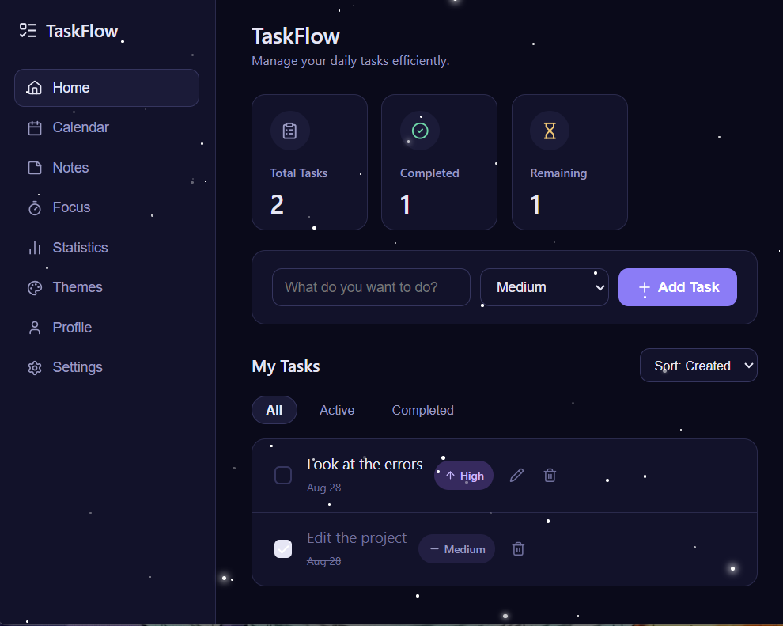 | 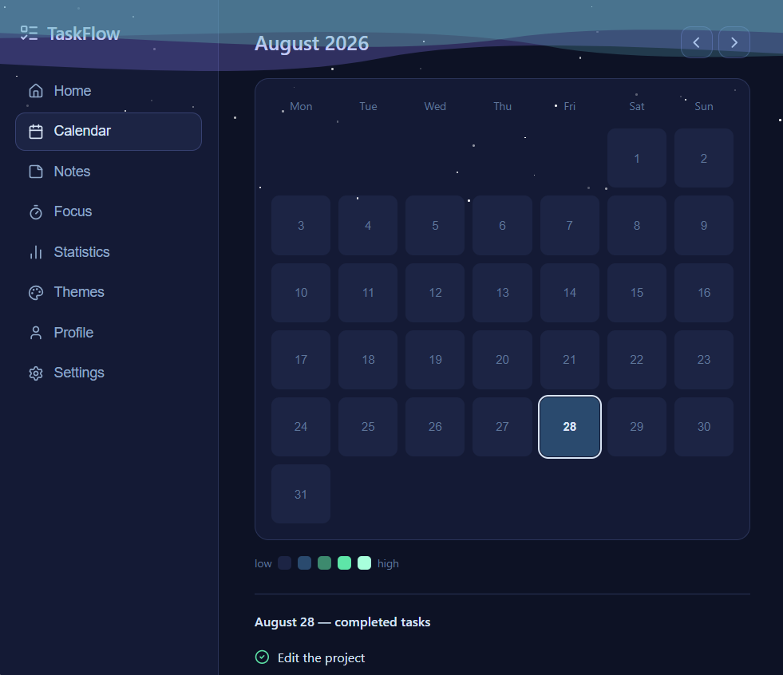 | 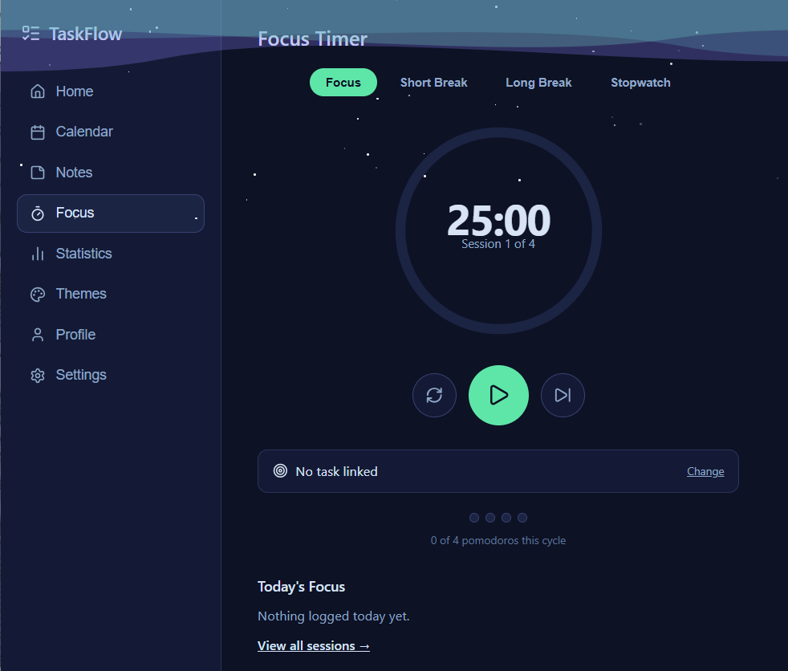 |

| Statistics | Themes | Settings | Profile |
| --- | --- | --- | --- |
| 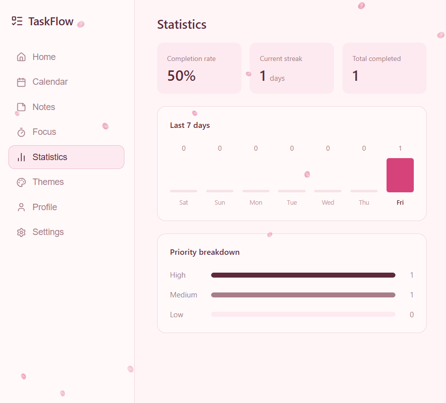 | 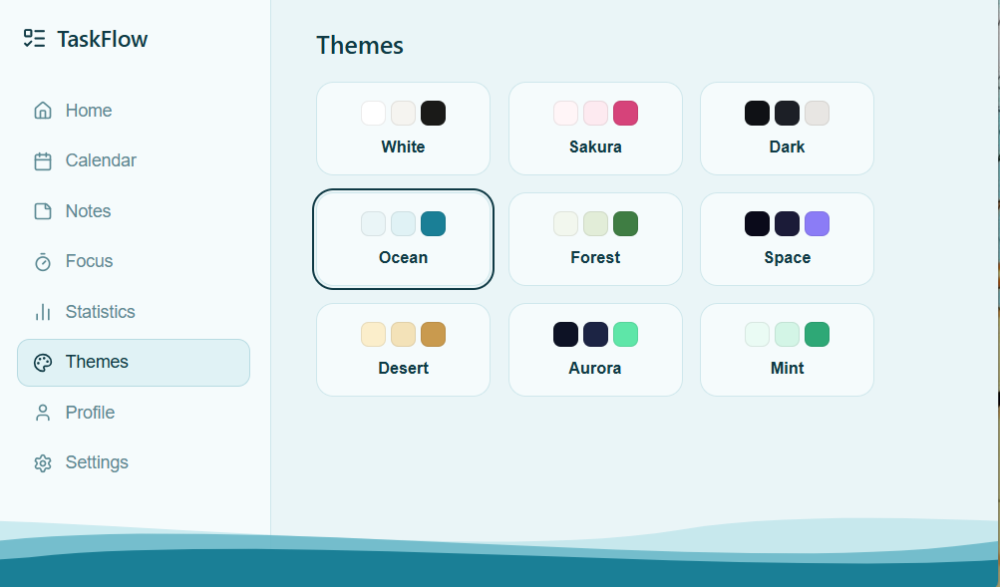 | 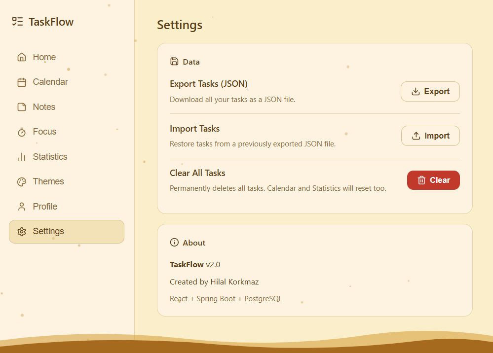 | 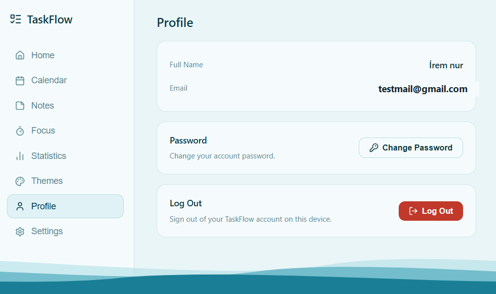 |

### Mobile

| Home | Calendar | Notes |
| --- | --- | --- |
| 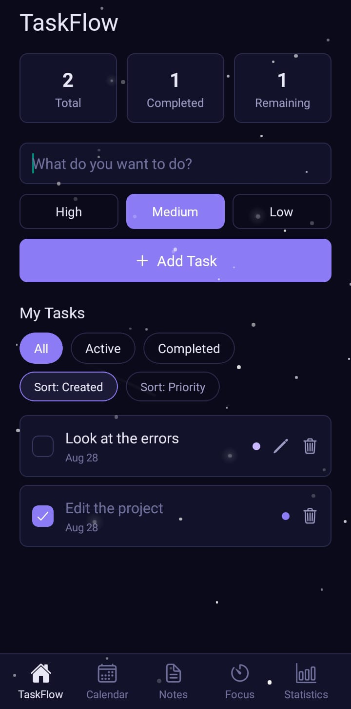 | 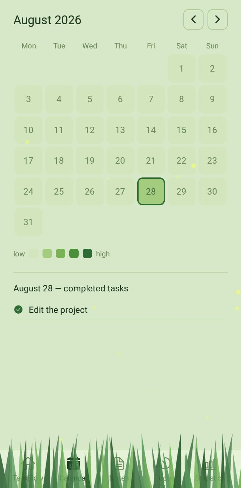 | 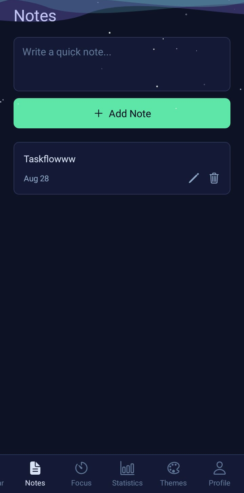 |

| Focus | Statistics | Themes |
| --- | --- | --- |
| 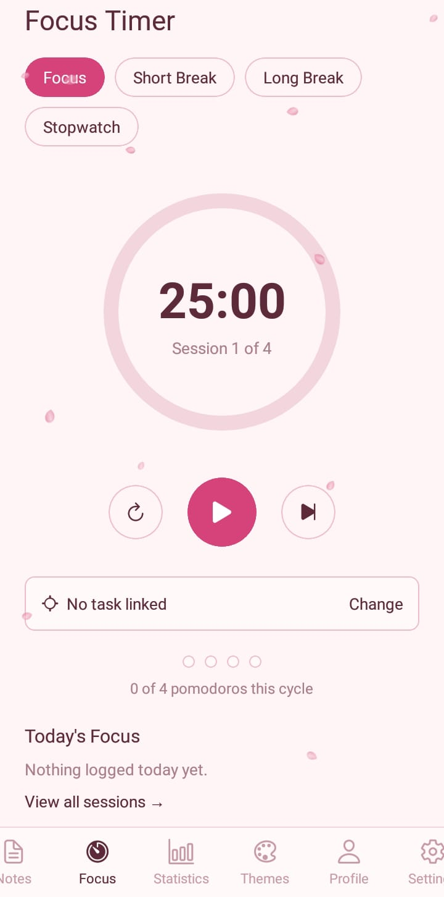 | 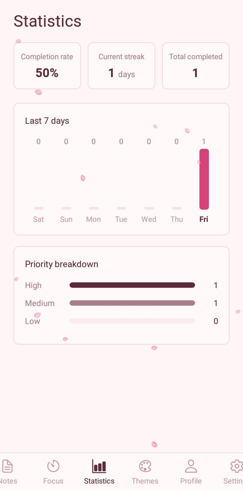 | 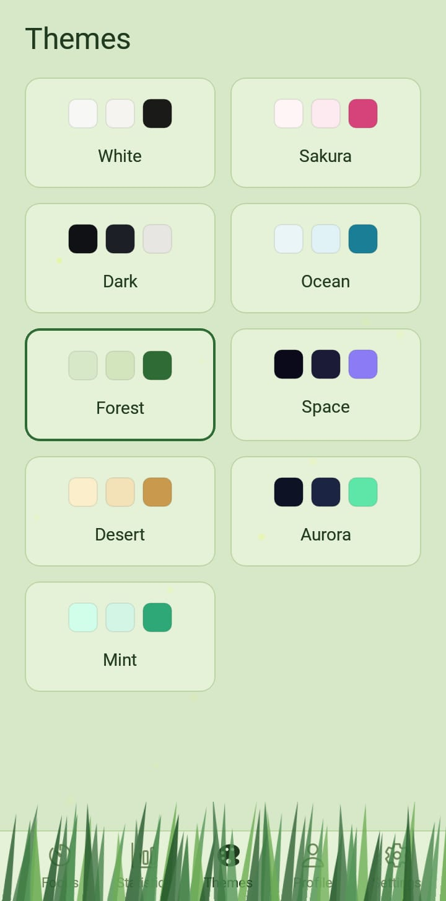 |

## Tech stack

**Backend** — Java 17, Spring Boot 3.5, Spring Security (JWT), Spring Data JPA, PostgreSQL, [Brevo](https://www.brevo.com/) (transactional email over HTTPS — chosen over raw SMTP because most cloud hosts block outbound SMTP ports), deployed on [Railway](https://railway.com/).

**Web / Desktop** — React 19, Vite, [lucide-react](https://lucide.dev/) icons, [Electron](https://www.electronjs.org/) + [electron-builder](https://www.electron.build/) for the Windows installer.

**Mobile** — [Expo](https://expo.dev/) (React Native, SDK 54), React Navigation (bottom tabs + native stack), `expo-audio`, `expo-notifications`, `expo-secure-store`, `react-native-svg` for the animated theme backgrounds.

## Project structure

```
taskflow/
├── backend/    # Spring Boot API (auth, tasks, notes, focus sessions)
├── frontend/   # React web app; also wrapped by Electron for the desktop build
├── mobile/     # Expo/React Native Android app
└── docs/       # README assets
```

## Getting started

### Backend

Requires a local PostgreSQL (a `docker-compose.yml` is included) and a few secrets as environment variables (or a `.env` file, loaded via `spring-dotenv`):

```bash
cd backend
docker compose up -d          # starts local Postgres
./mvnw spring-boot:run
```

Environment variables the backend reads (all have safe local defaults except the ones marked required):

| Variable | Purpose |
| --- | --- |
| `DB_URL`, `DB_USERNAME`, `DB_PASSWORD` | Postgres connection (defaults match `docker-compose.yml`) |
| `JWT_SECRET` | Signing key for auth tokens |
| `BREVO_API_KEY` **(required for email to actually send)** | Sends verification / password-reset codes |
| `MAIL_FROM` | Verified sender address in Brevo |
| `PORT` | HTTP port (defaults to `8080`) |

### Web

```bash
cd frontend
npm install
npm run dev
```

By default this points at the live Railway backend (`frontend/src/api/axiosInstance.js`) — point it at `http://localhost:8080/api` instead if you're running the backend locally.

### Desktop (Electron)

```bash
cd frontend
npm run electron:dev      # run in a window during development
npm run electron:build    # produce a Windows installer in frontend/release/
```

### Mobile

```bash
cd mobile
npm install
npx expo start
```

Scan the QR code with Expo Go, or produce a real installable APK with [EAS Build](https://docs.expo.dev/build/introduction/):

```bash
npx eas-cli build -p android --profile preview
```

## Author

Built by Hilal Korkmaz.
